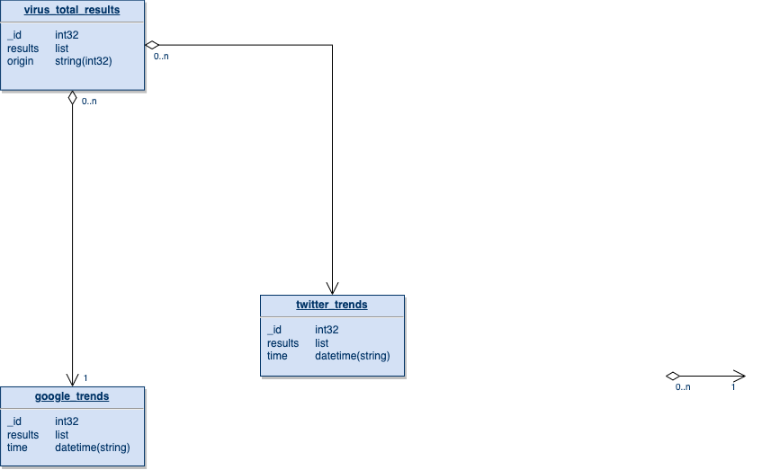

To pull and install Python library requirements: pip3 install -r requirements.txt

This project is meant to be installed on a server so that it can be run on a continuous basis. The main.py file should be executed from a CRON job daily. It has been throttled to not exceed the limits of the Virus Total API.

To run the data collection manually, run python -m main.py
Be sure to input your phone number into the Twilio entry points to receive text notifications of data collection.

## Database Structure

## MongoDB Commands
If you are using Windows or Mac, install a viewer like Studio 3T.
If using Linux, the following commands may help.
1. To start the MongoDB instance: `sudo service mongod start`
2. To stop the MondoDB instance: `sudo service mongod stop`
3. To restart eh MongoDB instance: `sudo service mongod restart`
4. To enter the Mongo shell, simply enter: `mongo`
5. Once in Mongo shell, show DBs by entering: `show dbs`
6. To export a Mongo database or collection, enter: `mongodump -d <database_name> -o <directory_backup>`
7. To import a Mongo database or collection, enter: `mongorestore -d <database_name> <directory_backup>`

To use SCP to copy a Mongo DB from the remote server to your local machine: `scp -r user@ssh.example.com:/path/to/remote/source /path/to/local/destination`
